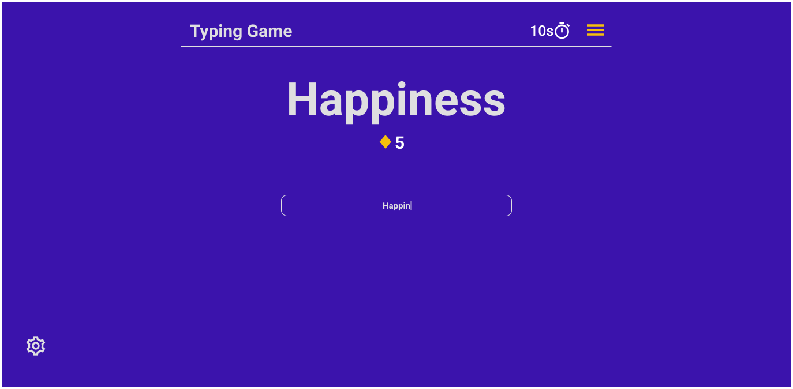
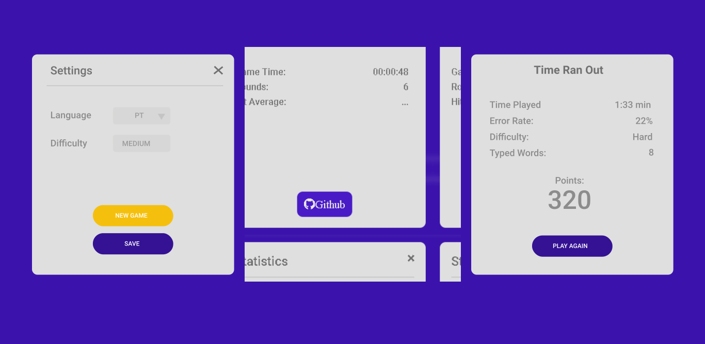

<h1 align = "center">Typing Game</h1>

<div align="center">  
   
   
</div>


<p align = "center">
    <a href="#about">About</a>   |
    <a href="#features">Features</a>   |
    <!-- <a href="#technologies">Technologies</a>   | -->
    <a href="#layout">Layout</a>   |
    <a href="#howToUse">How to use</a>   |
    <a href="#howToContribute">How to contribute</a>   |
    <a href="#license">License</a> 
</p>

<p align = "center"><p>  

<div align="center">
    Translate for 
    <a href="./github/readme_pt_br.md">PT-BR</a> 
</div>

 > 🎮 Project  Access : [Live Demo](https://victorpereiira.github.io/typing-game/public/index.html) 

 > 📄 Project Planner: [Kanban](https://github.com/users/VictorPereiira/projects/4)

## About
<p><b>Typing game</b> is a "mini game" developed in <b>Html5</b>, <b>Css3</b> and <b>Javascript</b>, and aims to improve the writing of words in <b>different languages</b>, enabling fun and learning in one place. The player can challenge himself among the <b>"difficulty levels"</b> available in the game, so at the end of each round he receives a score according to his performance.</p>

## What I Learned
 <p>This project was developed with the purpose of learning about <code>localStore</code> data manipulation and <code>DOM Events</code> handling.</p> 

## Features
- [X] Time control for `setInterval()`
- [X] Use `localStore` variables
- [X] Monitoring RandomWord for `event.input` 
- [X] Difficulty levels
- [X] Points system 
- [X] DrawArea HTML generator
- [X] Support other languages
- [ ] Hit Average
- [ ] Error Rate

  
<!-- ## Technologies
- [Vanilla JS](https://developer.mozilla.org/pt-BR/docs/Web/JavaScript) -->
  
## Layout




<h2 id="howToUse">How to use</h2>
<p>
    To clone this application, you'll need 
    <a href="https://git-scm.com/">Git</a>
    , installed on your computer.
</p>
<p>Execute the command line:</p>

### Clone the project

```bash
 ### Clone this repository

# with github classic token
$ git clone https://github.com/VictorPereiira/typing-game.git
# with ssh key
$ git clone git@github.com:VictorPereiira/typing-game.git

### Go into the repository
$ cd typing-game
```


<h2 id="howToContribute">How to contribute</h2>

- Make a fork;
- Create a branch with your feature: `git checkout -b my-feature`;
- Commit changes: `git commit -m "feat: my new feature`;
- Make a push to your branch: `git push origin my-feature`.
  
<p>After meging your receipt request to done, you can delete a branch from yours.</p>

## License
This project is under the MIT license. See the 
<a href = "https://github.com/VictorPereiira/typing-game/blob/master/LICENSE">LICENSE</a> 
for details.

#
<p align = "center">
    Made by 👨🏾‍💻 
    <a href="https://www.linkedin.com/in/victorpereiira">VictorPereira</a>
</p>
